<div align="center">

# VibeAudit

### AI-Powered Website Design Auditor

[](https://ai.google.dev/)
[](https://react.dev/)
[](https://flask.palletsprojects.com/)
[](https://playwright.dev/)

[](https://vibeaudit-delta.vercel.app)

**VibeAudit** crawls your website, analyzes it viewport-by-viewport using Gemini-powered AI agents, and generates scored reports on CTA effectiveness, theme consistency, and intent alignment — replacing manual design QA with structured, screenshot-backed feedback.

</div>

---

## The Problem

Modern web QA has automated tools for everything — **Lighthouse** for performance, **Ahrefs** for SEO, **OWASP ZAP** for security. But when it comes to **design validation**, the industry still depends on human reviewers manually scrolling through pages and eyeballing elements:

- *"Does this CTA button actually stand out?"*
- *"Is the color scheme consistent across all pages?"*
- *"Does this website match what the client asked for?"*

This process is **slow**, **subjective**, and **doesn't scale**. There is no tool that audits the visual, design-facing quality of a website the way a human reviewer would — until now.

---

## What VibeAudit Does

VibeAudit audits the **non-functional, design-facing** aspects of websites that traditional tools ignore:

| Audit Category | What It Checks |
|---|---|
| **CTA Effectiveness** | Button visibility, contrast ratios, placement, copywriting, conversion potential |
| **Theme Consistency** | Color palette coherence, typography, spacing, visual harmony across pages |
| **Intent Alignment** | Whether the actual design matches the owner's intended vision and goals |

The AI agent **scrolls through each page viewport by viewport** (just like a real user), captures screenshots, identifies issues, scores each category 0–100, and maps every finding to the exact screenshot where it was detected.

---

## How It Works

```mermaid
flowchart LR
    A["🌐 Enter URL\n+ Config"] --> B["📝 Describe\nYour Intent"]
    B --> C["🔍 AI Crawls\nSite via BFS"]
    C --> D["🖥️ Viewport by\nViewport Analysis"]
    D --> E["📊 Scored Report\n+ PDF Export"]

    style A fill:#1a1a2e,stroke:#4285F4,color:#fff
    style B fill:#1a1a2e,stroke:#4285F4,color:#fff
    style C fill:#1a1a2e,stroke:#4285F4,color:#fff
    style D fill:#1a1a2e,stroke:#4285F4,color:#fff
    style E fill:#1a1a2e,stroke:#34A853,color:#fff
```



1. **Configure** — Enter a URL, set max pages (1–5), and describe your design intent in natural language
2. **Intent Parsing** — Gemini 2.5 Flash Lite extracts structured criteria (website type, tone, audience, theme) from your description
3. **BFS Crawl** — The crawler systematically discovers and queues pages on the same domain
4. **AI Agent Analysis** — Gemini 3 Pro Preview drives a browser agent that navigates to each page, scrolls viewport-by-viewport, captures screenshots, evaluates CTAs and theme elements
5. **Real-Time Streaming** — Every agent thought, action, and finding streams live to the UI via WebSocket
6. **Report Generation** — Scored report with per-page breakdown, categorized issues, actionable recommendations, and screenshot evidence — exportable as PDF

---

## Features

- **Real-Time Agent Timeline** — Watch the AI agent think, act, and analyze in a live-updating timeline as it browses your site
- **Viewport-by-Viewport Analysis** — The agent scrolls through each page section by section, simulating real user behavior
- **Screenshot-Backed Issues** — Every flagged issue is tied to the exact viewport screenshot where it was found
- **Objective Scoring** — 0–100 scores with A–F grades for CTA efficiency and theme consistency
- **Intent-Aware Context** — The agent considers your described design intent throughout the entire analysis
- **Pre-Built Intent Templates** — 10 category templates (e-commerce, SaaS, portfolio, blog, etc.) to get started quickly
- **One-Click PDF Export** — Download the full report as a clean PDF
- **Multi-Page Crawling** — BFS-based page discovery analyzes up to 5 pages per audit

---

## Tech Stack

### Frontend
| Technology | Purpose |
|---|---|
| **React 19** + **Vite 7** | UI framework and build tool |
| **Socket.io Client** | Real-time WebSocket communication |
| **React Router DOM 7** | Client-side routing |
| **html2pdf.js** | Client-side PDF report export |
| **Lucide React** | Icon library |

### Backend
| Technology | Purpose |
|---|---|
| **Python Flask** | REST API server |
| **Flask-SocketIO** | WebSocket server for real-time streaming |
| **Google Generative AI** | Gemini 2.5 Flash Lite (intent parsing) + Gemini 3 Pro Preview (page analysis) |
| **browser-use** | AI agent framework for autonomous browser interaction (local Playwright or cloud via API key) |
| **Browser Use Cloud** | Managed cloud browser infrastructure for production deployment |
| **Playwright** | Local browser automation and screenshot capture (dev) |
| **NetworkX** | BFS graph-based page crawling |

### Deployment
| Service | Component |
|---|---|
| **Vercel** | Frontend hosting |
| **Render** | Backend hosting |

---

## Project Structure

```
VibeAudit/
├── qai-client/                # React frontend
│   └── src/
│       ├── Pages/             # Landing page, Login
│       ├── AgentPage/         # Audit configuration page
│       ├── AuditPage/         # Real-time analysis view
│       ├── ReportPage/        # Scored audit report
│       ├── ResourcesPage/     # Pre-built intent templates
│       ├── HistoryPage/       # Audit history (coming soon)
│       ├── Components/        # Shared UI components (Navbar, etc.)
│       └── assets/            # Screenshots and static assets
│
├── backend/                   # Python Flask backend
│   ├── app.py                 # Flask server + WebSocket handlers
│   ├── agent_core.py          # Gemini browser agent logic
│   ├── bfs_crawler.py         # BFS page discovery + orchestration
│   └── utils/
│       └── intent.py          # Natural language intent parsing
│
└── README.md
```

---

## Getting Started

### Prerequisites
- **Node.js** 18+
- **Python** 3.10+
- **Google Gemini API Key** ([Get one here](https://ai.google.dev/))

### Backend Setup

```bash
cd backend
python -m venv .venv
.venv\Scripts\activate        # Windows
# source .venv/bin/activate   # macOS/Linux
pip install -r requirements.txt
playwright install              # Only needed for local dev (skip if using Browser Use Cloud)
```

Create a `.env` file in `backend/`:
```env
GEMINI_API_KEY=your_gemini_api_key
ENABLE_SCREENSHOTS=yes
# Optional: Set this to use Browser Use Cloud instead of local Playwright
# When set, the agent runs on cloud browser infrastructure (no local browser needed)
# When absent, falls back to local Playwright (requires: playwright install)
# BROWSER_USE_API_KEY=your_browser_use_api_key
```

```bash
python app.py
```

### Frontend Setup

```bash
cd qai-client
npm install
```

Create a `.env` file in `qai-client/`:
```env
VITE_BACKEND_URL=http://localhost:5000
VITE_AUTH_USERNAME=your_username
VITE_AUTH_PASSWORD=your_password
```

```bash
npm run dev
```

The app will be available at `http://localhost:5173`.

---

## Architecture


---

## Built For

**Google Gemini 3 Hackathon** — Showcasing Gemini's capabilities in visual understanding, structured output generation, and autonomous browser agent interaction.

---


